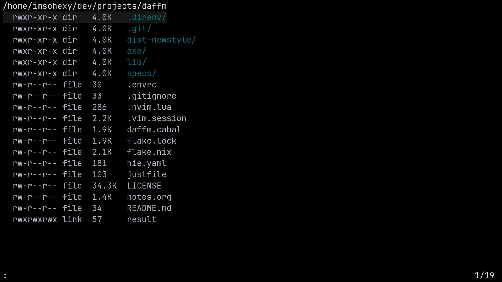

# Daffm
Dumb as fuck file manager is a minimal tui file manager with the goal of not being a file manager.
At its core, it only provides a directory browser, providing ways to conviniently run shell commands to manage your files via keybinds and command line input.



## Install
- Clone the repo and build it: `cabal build daffm` or `nix build`
- Nix flakes users can install it as a flake: `github:phenax/daffm#daffm`

## Usage
Run `man daffm` to see the manual -> [./docs/daffm.md](./docs/daffm.md)

## Config

Configuration is written in toml. By default it will try to load `$XDG_CONFIG_HOME/daffm/config.toml`.
You can load config in a different path using `daffm -c <path-to-config>`.
You can also store alternate configs in `$XDG_CONFIG_HOME/daffm/config.custom-thing.toml` and load it as `daffm -c @custom-thing`.

Here's an example config for reference:

```toml
# `opener` runs when opening a file or selections
opener = """
echo "%F" | while IFS= read file; do
  case "$(file --mime-type "$file" -bL)" in
    text/*) $EDITOR "$file" ;;
    *) xdg-open "$file" >/dev/null 2>&1 ;;
  esac
done;
"""

[keymap]
gdl = "cd ~/Downloads"
gdc = "cd ~/Documents"
gp = "cd ~/Pictures"

# File management
rn = ["!!clear; echo '%F' | vidir -v -", "selection-clear"] # Uses vidir (moreutils) to rename current or selected files
md = "cmdline-set !mkdir -p " # Prefills cmdline
mf = "cmdline-set !touch "
dd = "!!clear; rm -rfIv %f"
sdd = "!!clear; sudo rm -rfIv %f"
cc = ["!!cp % %.dup", "selection-clear"]
cp = ["!!cp -irv %s -t %d", "selection-clear"]
mv = ["!!mv -iv %s -t %d", "selection-clear"]

# Copy absolute file path to clipboard
YY = "!echo -n % | xclip -selection clipboard"
# Copy relative file path to clipboard (Relative to DAFFM_PATH_RELATIVE_TO or cwd)
yy = """shell
relpath=$(realpath -s --relative-to="${DAFFM_PATH_RELATIVE_TO:-$PWD}" %)
echo -n "$relpath" | xclip -selection clipboard
"""
# Copy entire file to clipboard
yf = """shell
xclip -selection clipboard -t $(file --mime-type % -bL) -i %
"""

# View image inside terminal
"<space>p" = "!!clear; chafa -f kitty %"

# Poor man's marks (mark directory by creating a binding)
# m1 marks current directory and <space>1 jumps to that directory
m1 = """command-shell echo "<daffm>map <space>1 cd %d" """
m2 = """command-shell echo "<daffm>map <space>2 cd %d" """
m3 = """command-shell echo "<daffm>map <space>3 cd %d" """
m4 = """command-shell echo "<daffm>map <space>4 cd %d" """
```


## Default keys (no need to define these in config)
Configuration files loaded override the following defaults

```toml
[keymap]
q = "quit"
rr = "reload"
"!" = "cmdline-set !"
":" = "cmdline-enter"

# Search in directory
"/" = "cmdline-set /"
n = "search-next"
N = "search-prev"

# Navigation (j/k for up/down)
gg = "move 0"
G = "move $"
gj = "move 0"
gk = "move $"
j = "move +1"
k = "move -1"
l = "open"
h = "back"
"<cr>" = "open"
"<bs>" = "back"

# Selection
v = "selection-toggle" # select/unselect files
"<tab>" = "selection-toggle"
C = "selection-clear"

"~" = "cd ~"
gh = "cd ~" # Go home
"$" = "$SHELL" # drop to shell
gx = "!xdg-open % >/dev/null 2>&1" # Open externally
gcfg = "cd ~/.config/daffm" # Open default configurations directory
```

